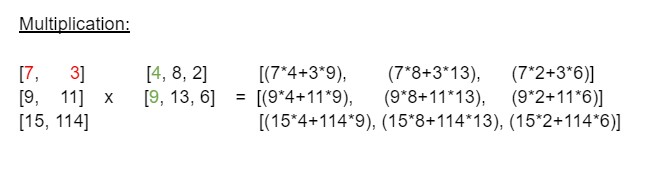

# Usage 

In the following some usage example are getting presented. 

<br>

## Datatype methods

```python
from matrops.matrix import Matrix as M
from matrops.vector import Vector as V

matrix = M([[1, 2, 3], [4, 5, 6], [7, 8, 9]])

matrix.print() # => prints the matrix in the console
matrix.get_number_rows() # => number of rows of the matrix (3)
matrix.get_number_coloumns() # => number of coloumns of the matrix (3)
matrix.get_data() # => returns the safed data with the format: list[list]
matrix.get_size() # => dimensions of the matrix with format (coloumns, rows)

vector = V([3, 0, 3])

vector.print() # => prints the vector in the console
vector.get_dimensions() # => length of data (2, starting at 0)
vector.get_data() # => returns the safed data with the format: list

```

## Calculations

```python
from matrops.matrix import Matrix as M, MatrixOps
from matrix.vector import Vector as V, VectorOps

# Create matrices
matrix1 = M([[1, 2, 3], [4, 5, 6]])
matrix2 = M([[7, 8, 9], [10, 11, 12]])
matrix3 = M([[1, 2, 3], [4, 5, 6], [7, 8, 9]])

# create vectors
vector1 = V([4, 6, 2])
vector2 = V([5, 7, 3])

scalar = 4

# scale matrix
matrix.scale(scalar)

# scale vector 
vector.scale(scalar)

# add 2 matrices 

add_result_m = MatrixOps.add(matrix1, matrix2) # Returns a matrix

# add 2 vectors

add_result_v = VectorOps.add(vector1, vector2) # Returns a vector

# subtract 2 matrices 

sub_result_m = MatrixOps.subtract(matrix1, matrix2)

# substract 2 vectors

sub_result_v = VectorOps.subtract(vector1, vector2) 

# mutliply 2 matrices 

multi_result_m = MatrixOps.multiply(matrix1, matrix3) 

# multiply 2 vectors 

multi_result_v = VectorOps.multiply(vector1, vector2)

# calculate the angle beetween to vectors

angle = VectorOps.angle_beetween(vector1, vector2) # Returns a float or an integer
```
<br>

# Explanations

In the following is explained how the methods are working on mathematical bases. 

<br>

## Table of contents 
<hr>

#### Matrix
- Addition of 2 matrices 
- Subtraction of 2 matrices 
- Scale a matrix 
- Multiplication of 2 matrices 
- Transpse a matrix

#### Vector
- Addition of 2 vectors 
- Subtraction of 2 vectors 
- Scale a vector 
- Multiplication of 2 vectors

<br>

## Matrix

<hr>

### <u>Addition of 2 matrices</u>

When adding 2 matrices, it's important for them to have the same size. (=rows and coloumns must be equal) Every index with the equivalent index in the other matrix is added with eachother. 


### <u>Subtraction of 2 matrices</u>

The substraction follows the same principles as the addition, but you substract the number at a certain index from the first matrix, with the same index in the second matrix. 


### <u>Scale a matrix</u>

Scaling a matrix means to multiply every index of the matrix with a scalar, 
in the example it's 2. 


### <u>Multiplication of 2 matrices</u>

Multiplying 2 matrices is connected to a condition. The coloumns of the first index must be equal to the number of rows of the second matrix. 

If this condition is true, the multiplication is possible. 

We take every row of the first one and multiply it with every coloumn of the second one. 

Example (red / green): 

First index of the row 7 multiplied with first index of the coloumn 4, [...]



### <u>Transpose a matrix</u>

Transposing a matrix means to switch the rows and the coloumns. 


<br>

## Vector 

<hr>

### Addition of 2 vectors 

The addition of 2 vectors follows the same rules as the addition of 2 matrices. Every index is added with the equivalent index at the other matrix. 


### Subtraction of 2 vectors 

The subtraction of 2 vectors follows the same rules as the subtraction of 2 matrices. Every index from the first matrix is getting subtracted with his equivalent at the other matrix.  


### Scale a vector 

Scaling a vector, means to mutliply every index with scalar. 


### Multiplication of 2 vectors

Every index is getting mutliplied with it's equivalent from the other matrix. 

